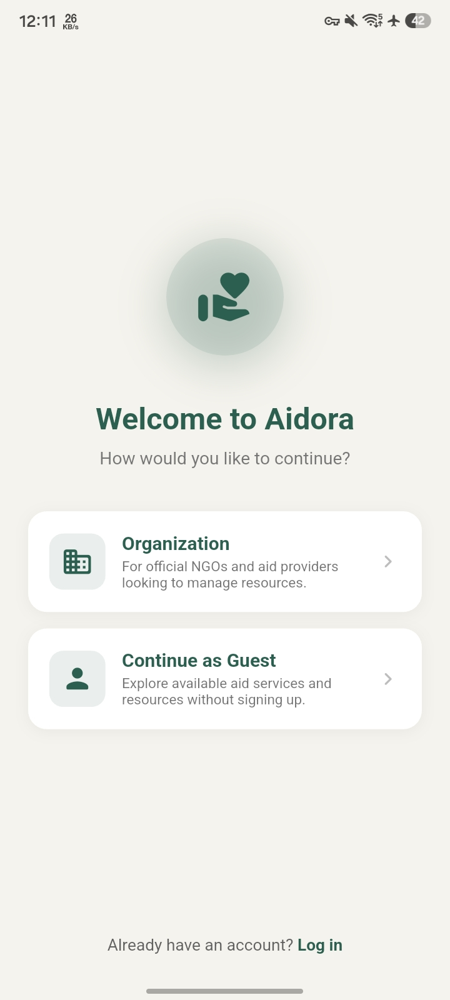
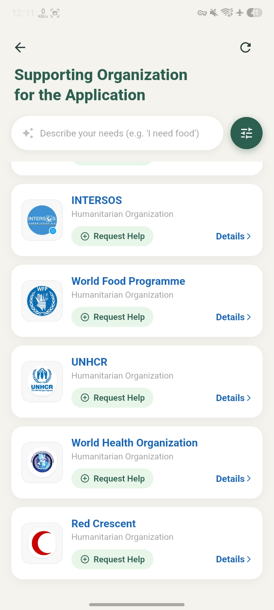
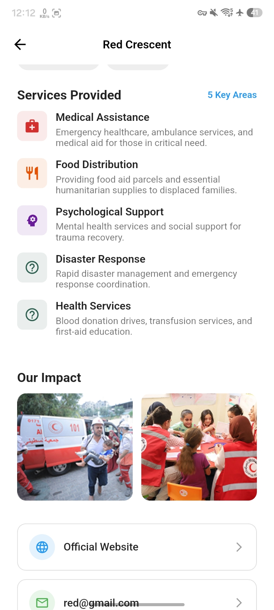
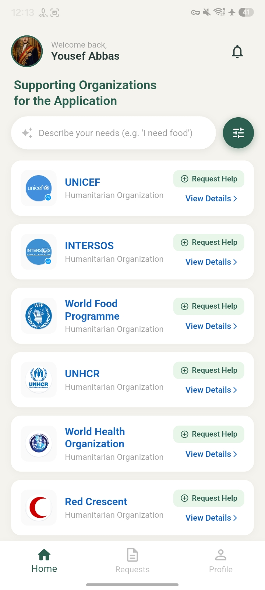
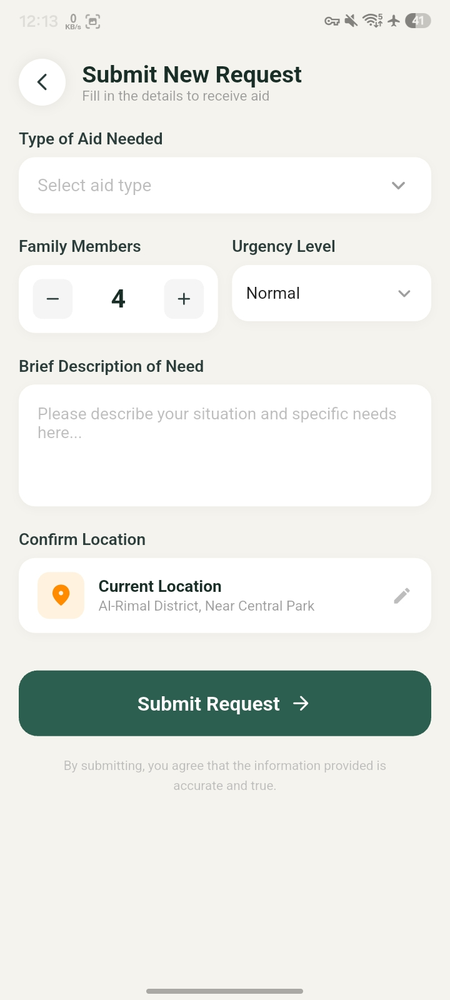

# Aidora ” Humanitarian Aid Coordination Platform

<p align="center">
  
</p>

<p align="center">
  <strong>Connecting displaced communities with humanitarian organizations and volunteers</strong>
</p>

<p align="center">
  
  
  
  
  
  
  
</p>

---

## Overview

**Aidora** is a full-stack humanitarian aid platform connecting refugees, volunteers, and organizations. It consists of two components living in this monorepo:

| Component | Location | Stack | Documentation |
|---|---|---|---|
| **Frontend** | repository root (`lib/`, `android/`, `ios/`, `test/`, ...) | Flutter, GetX, JWT client | this file (below) |
| **Backend** | [`backend/`](backend/) | Django REST Framework, PostgreSQL, Docker | [`backend/README.md`](backend/README.md) |

The Flutter client communicates with the Django backend through a JWT-secured REST API. See the architecture diagram below for how the two fit together.

---

## Architecture

```text
                         ┌─────────────────────┐
                         │   Flutter Mobile    │
                         │   Client (root)     │
                         └──────────┬──────────┘
                                    │
                              REST / JSON (JWT)
                                    │
                                    â–¼
                    ┌───────────────────────────┐
                    │   Django REST API          │
                    │   (backend/)               │
                    └─────────────┬─────────────┘
                                  │
          ┌───────────────────────┼───────────────────────┐
          │                       │                       │
          â–¼                       â–¼                       â–¼
    ┌───────────┐          ┌──────────────┐       ┌─────────────┐
    │  Accounts │          │ Organizations│       │  Requests   │
    └─────┬─────┘          └──────┬───────┘       └──────┬──────┘
          │                       │                       │
          └───────────────────────┼───────────────────────┘
                                  │
                                  â–¼
                         ┌─────────────────┐
                         │   PostgreSQL    │
                         └─────────────────┘
```

---

## Quick Start

Clone the repository:

```bash
git clone https://github.com/YousefAbaas/Aidora.git
cd Aidora
```

- To run the **Flutter app**, see [Getting Started](#getting-started) below.
- To run the **Django API**, see [`backend/README.md`](backend/README.md).

---

## Table of Contents

- [Why Aidora?](#why-aidora)
- [Core Capabilities](#core-capabilities)
- [User Roles](#user-roles)
- [Frontend Application Architecture](#frontend-application-architecture)
- [Project Structure](#project-structure)
- [State Management](#state-management)
- [Authentication & Session Management](#authentication--session-management)
- [API Layer](#api-layer)
- [Data Models](#data-models)
- [Profile & Image Management](#profile--image-management)
- [Notifications](#notifications)
- [QR Verification](#qr-verification)
- [Local Storage](#local-storage)
- [Localization](#localization)
- [Technology Stack](#technology-stack)
- [Code Quality & Engineering](#code-quality--engineering)
- [Testing](#testing)
- [Screenshots](#screenshots)
- [Getting Started](#getting-started)
- [CI/CD & Android Build Notes](#cicd--android-build-notes)
- [Security Considerations](#security-considerations)
- [Development Workflow](#development-workflow)
- [Engineering Highlights](#engineering-highlights)
- [Current Quality Status](#current-quality-status)
- [Roadmap](#roadmap)
- [Contributing](#contributing)
- [License](#license)

---

## Why Aidora?

Humanitarian assistance workflows can become fragmented when people need to identify available services, understand eligibility, submit requests, and communicate with organizations through disconnected channels.

Aidora aims to provide a single mobile-first interface where users can:

1. Discover humanitarian organizations.
2. Explore available services.
3. Create and manage assistance requests.
4. Maintain their personal profile.
5. Receive request-related notifications.
6. Interact with volunteer and organization workflows.
7. Verify assistance processes through QR-based workflows.

---

## Core Capabilities

| Capability              | Description                                                                     |
| ----------------------- | ------------------------------------------------------------------------------- |
| Authentication          | JWT-based authentication with login, registration, and token lifecycle handling |
| OTP Verification        | PIN-based verification workflow using Pinput                                    |
| Assistance Requests     | Create and manage humanitarian service requests                                 |
| Organization Discovery  | Browse and search humanitarian organizations                                    |
| Organization Profiles   | View organization information and available services                            |
| Guest Mode              | Explore organizations without requiring authentication                          |
| Profile Management      | Manage personal information and profile data                                    |
| Profile Images          | Select, upload, cache, and display profile images                               |
| Notifications           | Local notification infrastructure for application events                        |
| QR Verification         | QR scanning workflow for volunteer operations                                   |
| Multilingual UI         | Arabic and English interface support                                            |
| Smart Search            | Search interface for discovering relevant humanitarian services                 |
| Persistent Session Data | Local persistence using SharedPreferences                                       |
| External Links          | Open external resources through the platform URL handler                        |

---

## User Roles

```text
                         ┌────────────────────┐
                         │       Aidora       │
                         └─────────┬──────────┘
                                   │
                ┌──────────────────┼──────────────────┐
                │                  │                  │
                â–¼                  â–¼                  â–¼
        ┌───────────────┐  ┌───────────────┐  ┌───────────────┐
        │    Refugee    │  │ Organization  │  │   Volunteer   │
        └───────┬───────┘  └───────┬───────┘  └───────┬───────┘
                │                  │                  │
                â–¼                  â–¼                  â–¼
        Submit requests     Manage services     Process requests
        Track activity      Organization data   QR verification
        Manage profile      Service workflows   Request workflows
```

### Refugee / Beneficiary
Account registration, authentication, profile completion, organization/service discovery, request submission and tracking, profile image management, notifications.

### Organization
Organization information, service management workflows, request management, organization-specific screens, reporting workflows.

### Volunteer
Volunteer profile, request workflows, request status handling, QR scanning and verification.

### Guest
Unauthenticated users can browse public organization information and explore available services before creating an account.

---

## Frontend Application Architecture

Aidora follows a service-oriented Flutter structure that separates presentation, models, API communication, and reusable UI components.

```text
┌─────────────────────────────────────────────┐
│                 Flutter UI                  │
│ Screens / Views / Widgets / Navigation      │
└──────────────────────┬──────────────────────┘
                       â–¼
┌─────────────────────────────────────────────┐
│             State Management (GetX)          │
│ Controllers / Reactive State / UI Updates   │
└──────────────────────┬──────────────────────┘
                       â–¼
┌─────────────────────────────────────────────┐
│               Service Layer                 │
│ API Service / Auth Service / Upload Helpers │
└──────────────────────┬──────────────────────┘
                       â–¼
┌─────────────────────────────────────────────┐
│         REST API (Django REST Framework)     │
└──────────────────────┬──────────────────────┘
                       â–¼
┌─────────────────────────────────────────────┐
│  Backend Services — Authentication/Data/Requests │
└─────────────────────────────────────────────┘
```

---

## Project Structure

```text
Aidora/
├── lib/
│   ├── controllers/
│   ├── models/
│   ├── services/
│   ├── utils/
│   ├── views/
│   ├── widgets/
│   └── main.dart
├── test/
│   ├── unit/
│   ├── widget/
│   └── integration/
├── android/ ios/ web/ windows/ linux/ macos/
├── backend/                 ← Django REST Framework API (see backend/README.md)
└── .github/workflows/
    ├── flutter-ci.yml
    └── django-ci.yml
```

---

## State Management

Aidora uses **GetX** for reactive application state and controller-based coordination. For example, profile image changes are synchronized between the profile screen, relevant controllers, and other screens that consume the same state, reducing manual refresh logic.

---

## Authentication & Session Management

```text
User → Login/Registration → Authentication API → JWT credentials
     → Local session persistence → Authenticated API requests
          ├── Token valid ───────────────► Continue request
          └── Token expired → Refresh token → Retry request
```

Centralized in `lib/services/auth_service.dart` and `lib/services/api_service.dart`.

---

## API Layer

API responsibilities are centralized in dedicated service classes instead of embedding HTTP logic inside screens — consistent HTTP handling, centralized auth behavior, easier error handling, better testability, reduced duplication.

Primary HTTP dependency: `http`. Backend: Django REST Framework with JWT authentication (see [`backend/README.md`](backend/README.md) for API endpoint reference).

---

## Data Models

API responses are represented through dedicated Dart models (organizations, assistance requests, user info, authentication responses, service-related data), keeping serialization predictable.

---

## Profile & Image Management

Selection, upload, caching, and display via `image_picker` and `cached_network_image`. Profile image state is synchronized reactively so updates propagate across screens without manual refresh.

---

## Notifications

Local notification infrastructure via `flutter_local_notifications` and `timezone`.

---

## QR Verification

Volunteer workflows include QR scanning via `mobile_scanner`.

---

## Local Storage

Lightweight persistence via `shared_preferences` for session-related state and preferences.

---

## Localization

Arabic and English UI support via the `intl` package.

---

## Technology Stack

### Frontend
| Technology   | Purpose                                       |
| ------------ | --------------------------------------------- |
| Flutter      | Cross-platform application framework          |
| Dart         | Application programming language              |
| GetX         | State management and reactive UI coordination |
| Google Fonts | Typography                                    |
| Flutter SVG  | SVG rendering                                 |
| Pinput       | PIN / OTP input                               |
| intl         | Internationalization and formatting           |

### Networking & Backend Integration
| Technology            | Purpose                |
| --------------------- | ----------------------- |
| HTTP                  | REST API communication |
| Django REST Framework | Backend API             |
| JWT                   | Authentication          |

### Device & Platform Features
| Package                     | Purpose                 |
| ---------------------------- | ------------------------ |
| image_picker                | Image selection         |
| cached_network_image        | Network image caching   |
| mobile_scanner              | QR / barcode scanning   |
| permission_handler          | Runtime permissions     |
| flutter_local_notifications | Local notifications     |
| timezone                    | Notification scheduling |
| url_launcher                 | External URLs            |

### Local Persistence
| Package            | Purpose                        |
| ------------------- | -------------------------------- |
| shared_preferences | Lightweight persistent storage |

### Development & Testing
| Package       | Purpose                     |
| ------------- | ---------------------------- |
| flutter_test  | Flutter testing framework   |
| Mockito       | Mocking and isolated tests  |
| build_runner  | Code generation             |
| flutter_lints | Static analysis and linting |

---

## Code Quality & Engineering

Recent engineering work: hardened the API layer, stabilized Flutter integration/widget tests, improved authentication and API response handling, strengthened image upload/URL handling, synchronized profile state across screens, cleaned unused code, improved null-safety patterns.

```text
flutter analyze
No errors
No warnings
```

---

## Testing

```text
test/
├── unit/
│   ├── auth_service_test.dart
│   └── models_test.dart
├── widget/
│   └── login_screen_test.dart
└── integration/
    └── app_flow_test.dart
```

Includes authentication service testing, model testing, widget-level UI testing, HTTP behavior isolation, Mockito-based mocking, and local storage isolation.

---

## Screenshots

<p align="center">
  
  
  
  
  
</p>

---

## Getting Started

### Prerequisites

```bash
flutter doctor
flutter --version
```

Compatible Dart SDK (from `pubspec.yaml`):
```yaml
environment:
  sdk: '>=3.4.0 <4.0.0'
```

### Installation

```bash
git clone https://github.com/YousefAbaas/Aidora.git
cd Aidora
flutter pub get
flutter analyze
flutter test
flutter run
```

> To run the backend the app depends on, see [`backend/README.md`](backend/README.md).

---

## CI/CD & Android Build Notes

Aidora uses GitHub Actions for continuous integration. Every push triggers static analysis, unit/integration tests, and a release APK build (`flutter-ci.yml`). The Django backend has its own workflow (`django-ci.yml`) — see [`backend/README.md`](backend/README.md) for backend-specific CI notes.

### Pinned Toolchain Versions

| Tool                          | Version |
| ------------------------------ | -------- |
| Flutter                       | 3.47.0  |
| Android Gradle Plugin (AGP)   | 8.12.0  |
| Gradle                        | 8.14.1  |

Defined in:
```text
android/settings.gradle                            → AGP version
android/gradle/wrapper/gradle-wrapper.properties   → Gradle version
.github/workflows/flutter-ci.yml                   → Flutter version used in CI
```

When upgrading Flutter locally, verify these three stay aligned before pushing — a mismatch is the most common cause of a CI build that fails while `flutter analyze`/`flutter test` pass locally.

### CI Pipeline Stages

```text
Checkout → Set up Flutter → pub get → Analyze → Unit tests → Integration tests → Build APK → Upload artifact
```

### Troubleshooting

| Symptom | Cause | Fix |
| --- | --- | --- |
| CI fails but `flutter analyze`/`flutter test` pass locally | Local changes were never committed/pushed | Run `git status`; commit and push all pending changes |
| `AGP version is lower than Flutter's minimum supported version` | Flutter was upgraded without updating AGP | Bump the version in `com.android.application` in `android/settings.gradle` |
| Gradle resolves a nonexistent artifact version (e.g. `*-31.11.1.jar`) | A specific AGP patch release had a broken lint-tooling version mapping | Use an adjacent AGP version (e.g. `8.12.0` instead of `8.11.1`) |
| `Could not download <package>.jar` / socket/SSL errors during build | Unstable network connection during dependency download | Retry on a more stable connection; Gradle resumes from its local cache |
| Invalid workflow file / yaml syntax error on a specific line | Incorrect indentation or a duplicated step in the `.yml` file | YAML is indentation-sensitive — verify 2-space nesting, no duplicate `uses:` lines |
| Widget finder test fails with "Found 0 widgets" despite matching text | Source file saved with incorrect encoding, corrupting non-ASCII characters | Rebuild the string programmatically (e.g. `'\u2022' * 8`) instead of pasting the literal character |

---

## Security Considerations

- JWT-based authentication and token lifecycle management
- Authenticated API requests, separation of API and UI responsibilities
- No hard-coded secrets on the frontend
- Local persistence limited to lightweight, non-sensitive data
- Platform permission handling for protected device capabilities

See [`backend/README.md`](backend/README.md) for backend-side security (environment variables, secret handling).

---

## Development Workflow

Incremental Git-based workflow. Before opening a pull request, verify:

```bash
flutter analyze
flutter test
```

Avoid committing generated files, IDE configuration, secrets, or machine-specific files.

---

## Engineering Highlights

**Architecture:** service-oriented API communication, dedicated auth service, dedicated data models, reusable widgets, controller-based reactive state.

**Reliability:** defensive API handling, auth lifecycle handling, test isolation, image upload resilience.

**Maintainability:** centralized service responsibilities, static analysis, automated tests, Git-based incremental development.

**Platform Integration:** QR scanning, image selection/upload, local notifications, runtime permissions, external URL handling.

---

## Current Quality Status

| Area                        | Status       |
| ----------------------------- | ------------- |
| Flutter Analyzer            | ✅ 0 errors   |
| Analyzer Warnings           | ✅ 0 warnings |
| Unit Tests                  | Implemented  |
| Widget Tests                | Implemented  |
| Integration Tests           | Implemented  |
| JWT Authentication          | Implemented  |
| REST API Integration        | Implemented  |
| GetX Reactive State         | Implemented  |
| Profile Image Handling      | Implemented  |
| QR Scanning                 | Implemented  |
| Local Notifications         | Implemented  |
| Arabic / English UI         | Implemented  |
| Guest Organization Browsing | Implemented  |
| Flutter CI (GitHub Actions) | ✅ Passing    |
| Django CI (GitHub Actions)  | ✅ Passing    |

---

## Roadmap

- Complete Flutter API deprecation migration
- Improve automated test coverage
- Expand integration and end-to-end testing
- Improve offline resilience
- Introduce stronger centralized error reporting
- Improve accessibility
- Add production monitoring and analytics
- Improve CI/CD automation

---

## Contributing

Aidora is currently maintained as a proprietary project.

1. Create a focused branch.
2. Keep changes scoped to a single responsibility.
3. Run static analysis and relevant tests.
4. Review the Git diff.
5. Use descriptive commit messages.
6. Avoid committing generated files, IDE configuration, secrets, or machine-specific files.

---

## License

This project is currently distributed under a **proprietary license**. The source code, design, assets, and associated project materials are not licensed for unrestricted redistribution or commercial reuse without permission from the project owner.

---

## Project Status

**Current development version:** `1.0.0`

---

## ?? License & Attribution

Aidora is an open-source project originally created and maintained by **Yousef Abbas**.

Copyright © 2026 Yousef Abbas.

This project is licensed under the **Apache License 2.0**.

You are free to use, modify, and distribute this project in accordance with the license. If you fork, modify, or redistribute Aidora, please preserve the original copyright notices, license information, and attribution.

**Original repository:**  
https://github.com/YousefAbaas/Aidora
