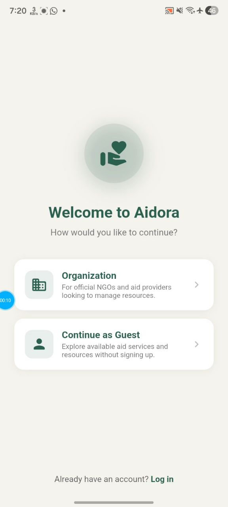
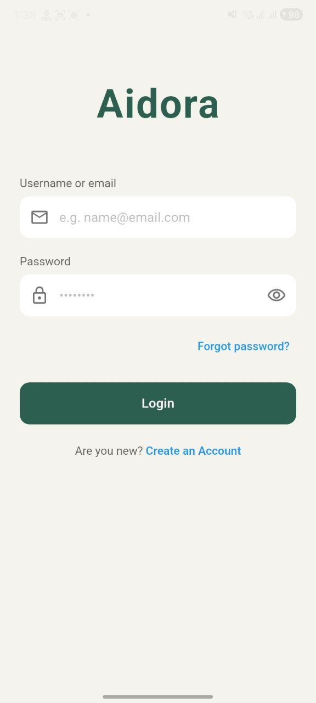
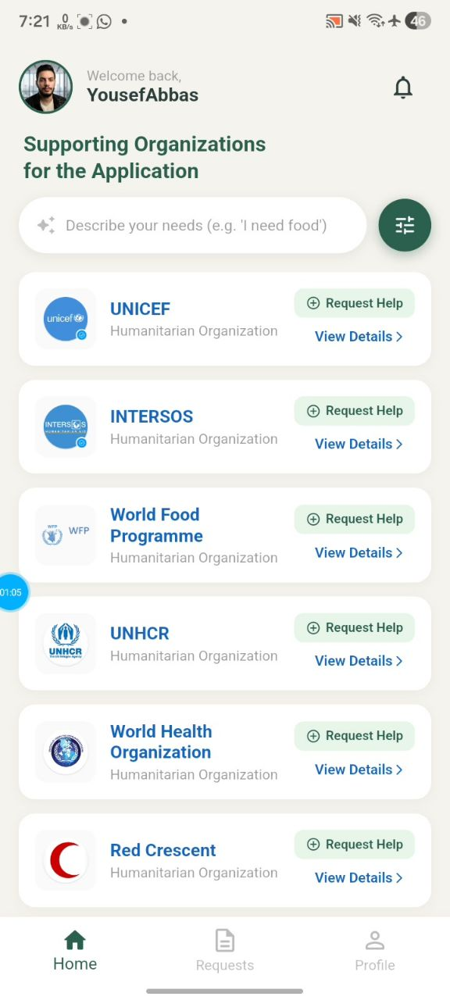
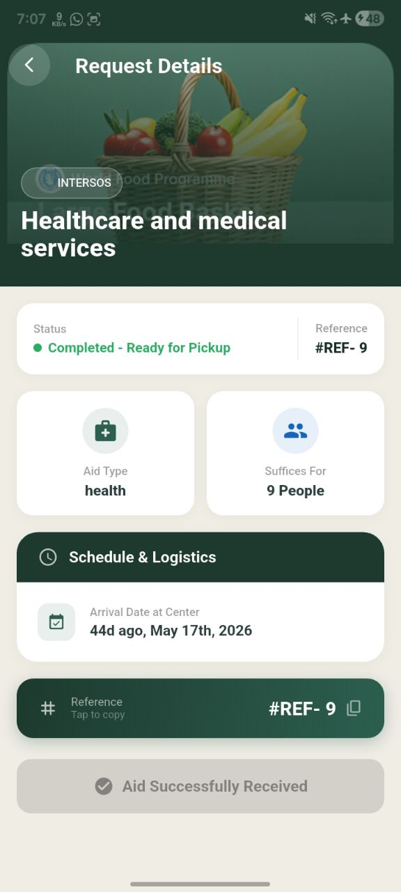
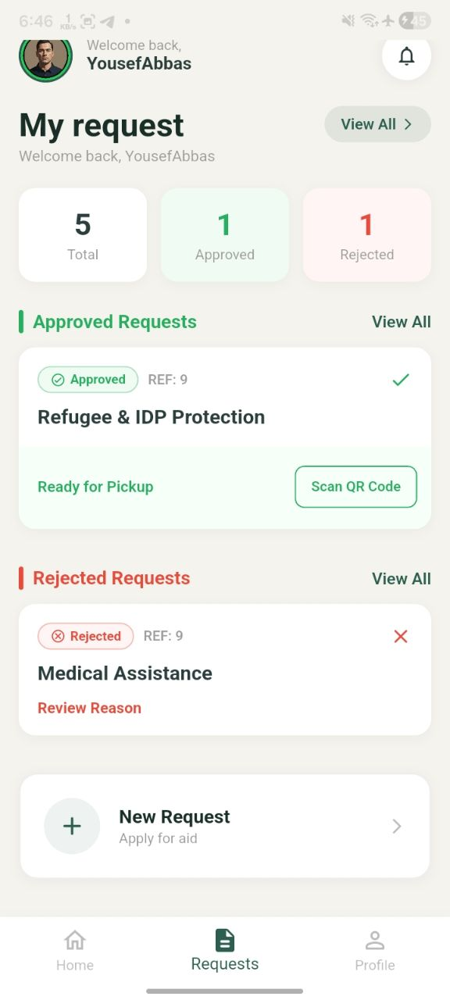
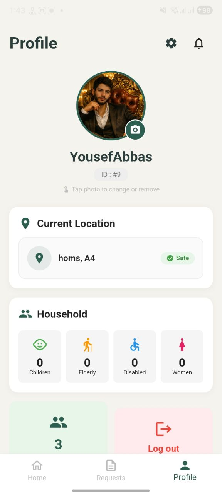

# Aidora — Humanitarian Aid Coordination Platform

<p align="center">
  
</p>

<p align="center">
  <strong>Connecting displaced communities with humanitarian organizations and volunteers</strong>
</p>

<p align="center">
  
  
  
  
  
  
  
</p>

---
## Table of Contents

- [Overview](#overview)
- [Why Aidora?](#why-aidora)
- [Core Capabilities](#core-capabilities)
- [User Roles](#user-roles)
- [Application Architecture](#application-architecture)
- [Project Structure](#project-structure)
- [State Management](#state-management)
- [Authentication & Session Management](#authentication--session-management)
- [API Layer](#api-layer)
- [Data Models](#data-models)
- [Profile & Image Management](#profile--image-management)
- [Notifications](#notifications)
- [QR Verification](#qr-verification)
- [Local Storage](#local-storage)
- [Localization](#localization)
- [Technology Stack](#technology-stack)
- [Code Quality & Engineering](#code-quality--engineering)
- [Testing](#testing)
- [Screenshots](#screenshots)
- [Getting Started](#getting-started)
- [CI/CD & Android Build Notes](#cicd--android-build-notes)
- [Environment Configuration](#environment-configuration)
- [Backend Integration](#backend-integration)
- [Security Considerations](#security-considerations)
- [Development Workflow](#development-workflow)
- [Engineering Highlights](#engineering-highlights)
- [Current Quality Status](#current-quality-status)
- [Roadmap](#roadmap)
- [Contributing](#contributing)
- [License](#license)
- - API
  - [Live API](https://aidora-z01k.onrender.com)
  - [API Documentation](https://aidora-z01k.onrender.com/api/docs/)
---
## Overview

**Aidora** is a cross-platform Flutter application designed to improve coordination between displaced communities, humanitarian organizations, and volunteers.

The platform provides a structured digital workflow for discovering humanitarian services, submitting assistance requests, managing user profiles, tracking request-related activity, and supporting organization and volunteer workflows.

Aidora consists of a **Flutter client** integrated with a **Django REST Framework backend** through a JWT-secured API.

The application is designed with a focus on:

* Clear separation between UI, application logic, models, and services
* Secure authentication and session management
* Reliable API communication
* Reactive state management
* Profile and image management
* Humanitarian request workflows
* Organization discovery and service navigation
* Volunteer-oriented verification workflows
* Automated testing and static code analysis

---

## Why Aidora?

Humanitarian assistance workflows can become fragmented when people need to identify available services, understand eligibility, submit requests, and communicate with organizations through disconnected channels.

Aidora aims to provide a single mobile-first interface where users can:

1. Discover humanitarian organizations.
2. Explore available services.
3. Create and manage assistance requests.
4. Maintain their personal profile.
5. Receive request-related notifications.
6. Interact with volunteer and organization workflows.
7. Verify assistance processes through QR-based workflows.

The goal is to make the process more structured, accessible, and easier to manage for both beneficiaries and humanitarian teams.

---

## Core Capabilities

| Capability              | Description                                                                     |
| ----------------------- | ------------------------------------------------------------------------------- |
| Authentication          | JWT-based authentication with login, registration, and token lifecycle handling |
| OTP Verification        | PIN-based verification workflow using Pinput                                    |
| Assistance Requests     | Create and manage humanitarian service requests                                 |
| Organization Discovery  | Browse and search humanitarian organizations                                    |
| Organization Profiles   | View organization information and available services                            |
| Guest Mode              | Explore organizations without requiring authentication                          |
| Profile Management      | Manage personal information and profile data                                    |
| Profile Images          | Select, upload, cache, and display profile images                               |
| Notifications           | Local notification infrastructure for application events                        |
| QR Verification         | QR scanning workflow for volunteer operations                                   |
| Location Data           | Store and display relevant user location information                            |
| Multilingual UI         | Arabic and English interface support                                            |
| Smart Search            | Search interface for discovering relevant humanitarian services                 |
| Persistent Session Data | Local persistence using SharedPreferences                                       |
| External Links          | Open external resources through the platform URL handler                        |

---

# User Roles

Aidora is designed around multiple user experiences.

```text
                         ┌────────────────────┐
                         │       Aidora       │
                         └─────────┬──────────┘
                                   │
                ┌──────────────────┼──────────────────┐
                │                  │                  │
                ▼                  ▼                  ▼
        ┌───────────────┐  ┌───────────────┐  ┌───────────────┐
        │    Refugee    │  │ Organization  │  │   Volunteer   │
        └───────┬───────┘  └───────┬───────┘  └───────┬───────┘
                │                  │                  │
                ▼                  ▼                  ▼
        Submit requests     Manage services     Process requests
        Track activity      Organization data   QR verification
        Manage profile      Service workflows   Request workflows
```

### Refugee / Beneficiary

The beneficiary-facing workflow focuses on discovering services and requesting assistance.

Typical capabilities include:

* Account registration
* Authentication
* Profile completion
* Organization discovery
* Service discovery
* Assistance request submission
* Request tracking
* Profile image management
* Notifications

### Organization

Organizations provide humanitarian services through organization-specific workflows.

Typical capabilities include:

* Organization information
* Service management workflows
* Request management
* Organization-specific screens
* Reporting workflows

### Volunteer

Volunteer workflows focus on assisting organizations with request processing and verification.

Typical capabilities include:

* Volunteer profile
* Request workflows
* Request status handling
* QR scanning and verification

### Guest

Unauthenticated users can browse public organization information and explore available services before creating an account.

---

## API Documentation

Aidora provides a RESTful API built with Django REST Framework and documented using the OpenAPI specification.

The API documentation is available through an interactive Swagger UI, allowing developers to explore endpoints, inspect request and response schemas, authenticate using JWT, and test API operations directly.

### Live API

🌐 API Base URL:  
https://aidora-z01k.onrender.com

### Interactive API Documentation

📚 Swagger UI:  
https://aidora-z01k.onrender.com/api/docs/

The API documentation covers:

- 🔐 Authentication and JWT authorization
- 👤 Volunteer management
- 🏢 Organization management
- 📋 Service requests
- 📦 Request and response schemas
- 🛡️ Protected API endpoints
- ⚡ Interactive endpoint testing

> Note: Swagger UI provides an interactive interface for exploring and testing the documented Aidora API endpoints.
----

# Application Architecture

Aidora follows a service-oriented Flutter structure that separates presentation, models, API communication, and reusable UI components.

```text
┌─────────────────────────────────────────────┐
│                 Flutter UI                  │
│                                             │
│ Screens / Views / Widgets / Navigation      │
└──────────────────────┬──────────────────────┘
                       │
                       ▼
┌─────────────────────────────────────────────┐
│             State Management                │
│                    GetX                     │
│                                             │
│ Controllers / Reactive State / UI Updates   │
└──────────────────────┬──────────────────────┘
                       │
                       ▼
┌─────────────────────────────────────────────┐
│               Service Layer                 │
│                                             │
│ API Service / Auth Service / Upload Helpers │
└──────────────────────┬──────────────────────┘
                       │
                       ▼
┌─────────────────────────────────────────────┐
│                 REST API                    │
│                                             │
│          Django REST Framework              │
└──────────────────────┬──────────────────────┘
                       │
                       ▼
┌─────────────────────────────────────────────┐
│              Backend Services               │
│                                             │
│       Authentication / Data / Requests      │
└─────────────────────────────────────────────┘
```

---

## Project Structure

The project is organized around application responsibilities rather than putting all application logic inside individual screens.

```text
lib/
├── core/
│   └── Application-wide infrastructure
│
├── models/
│   └── API and application data models
│
├── services/
│   ├── API communication
│   ├── Authentication
│   ├── Upload handling
│   └── Supporting services
│
├── utils/
│   ├── Theme utilities
│   ├── Image URL handling
│   └── Shared helpers
│
├── views/
│   ├── Authentication
│   ├── Refugee workflows
│   ├── Organization workflows
│   ├── Volunteer workflows
│   └── Shared application screens
│
├── widgets/
│   └── Reusable UI components
│
└── main.dart
```

Tests are maintained separately:

```text
test/
├── unit/
└── widget/
```

---

# State Management

Aidora uses **GetX** for reactive application state and controller-based coordination.

Reactive values are used where UI state needs to respond immediately to application changes.

For example, profile image changes are synchronized between the profile screen, relevant controllers, and other screens that consume the same state.

This reduces unnecessary manual refresh logic and allows dependent UI components to react to state changes.

---

# Authentication & Session Management

Authentication is handled through a JWT-based backend integration.

The application contains dedicated authentication and API services rather than embedding authentication logic directly inside UI screens.

The general lifecycle is:

```text
User
 │
 ▼
Login / Registration
 │
 ▼
Authentication API
 │
 ▼
JWT credentials
 │
 ▼
Local session persistence
 │
 ▼
Authenticated API requests
 │
 ├── Token valid ───────────────► Continue request
 │
 └── Token expired
          │
          ▼
      Refresh token
          │
          ▼
      Retry request
```

Authentication-related responsibilities are primarily centralized in:

```text
lib/services/auth_service.dart
lib/services/api_service.dart
```

This separation makes authentication easier to maintain and test independently from the UI.

---

# API Layer

The Flutter application communicates with the backend through a dedicated service layer.

Instead of allowing screens to directly implement HTTP logic, API responsibilities are centralized in service classes.

This provides:

* Consistent HTTP handling
* Centralized authentication behavior
* Easier error handling
* Better testability
* Reduced duplication
* Clear separation between UI and networking

The primary HTTP dependency is:

```text
http
```

The backend is implemented using:

```text
Django REST Framework
```

with JWT authentication.

---

# Data Models

API responses are represented through dedicated Dart models.

Examples include models for:

* Organizations
* Assistance requests
* User information
* Authentication responses
* Service-related data

Keeping API structures inside model classes makes serialization and application-level data handling more predictable.

---

# Profile & Image Management

Aidora supports profile image selection, upload, caching, and display.

The image workflow is separated into dedicated helpers and reusable UI components.

Relevant dependencies include:

```text
image_picker
cached_network_image
```

The application also contains platform-specific image handling where required.

Profile image state is synchronized with reactive application state so that updated images can propagate across relevant screens without requiring unnecessary navigation or manual refresh operations.

---

# Notifications

Aidora uses local notification infrastructure through:

```text
flutter_local_notifications
timezone
```

This provides the foundation for displaying application-related notifications while allowing notification scheduling to be handled independently from the UI.

---

# QR Verification

Volunteer workflows include QR scanning using:

```text
mobile_scanner
```

The scanner is integrated into the volunteer workflow to support verification-oriented interactions.

---

# Local Storage

Aidora uses:

```text
shared_preferences
```

for lightweight persistent application data.

This is suitable for values such as local session-related state and user preferences that do not require a relational database.

---

# Localization

The application supports multilingual UI experiences, including:

* Arabic
* English

The `intl` package is used for localization and formatting-related functionality.

The UI is designed so that user-facing strings can be translated without embedding language-specific logic into the application flow.

---

# Technology Stack

## Frontend

| Technology   | Purpose                                       |
| ------------ | --------------------------------------------- |
| Flutter      | Cross-platform application framework          |
| Dart         | Application programming language              |
| GetX         | State management and reactive UI coordination |
| Google Fonts | Typography                                    |
| Flutter SVG  | SVG rendering                                 |
| Pinput       | PIN / OTP input                               |
| intl         | Internationalization and formatting           |

## Networking & Backend Integration

| Technology            | Purpose                |
| --------------------- | ---------------------- |
| HTTP                  | REST API communication |
| Django REST Framework | Backend API            |
| JWT                   | Authentication         |

## Device & Platform Features

| Package                     | Purpose                 |
| --------------------------- | ----------------------- |
| image_picker                | Image selection         |
| cached_network_image        | Network image caching   |
| mobile_scanner              | QR / barcode scanning   |
| permission_handler          | Runtime permissions     |
| flutter_local_notifications | Local notifications     |
| timezone                    | Notification scheduling |
| url_launcher                | External URLs           |

## Local Persistence

| Package            | Purpose                        |
| ------------------ | ------------------------------ |
| shared_preferences | Lightweight persistent storage |

## Development & Testing

| Package       | Purpose                     |
| ------------- | --------------------------- |
| flutter_test  | Flutter testing framework   |
| Mockito       | Mocking and isolated tests  |
| build_runner  | Code generation             |
| flutter_lints | Static analysis and linting |

---

# Code Quality & Engineering

Code quality is treated as part of the development workflow rather than as a final cleanup step.

Recent engineering work focused on:

* Hardening the API layer
* Stabilizing Flutter integration and widget tests
* Improving authentication handling
* Improving API response handling
* Strengthening image upload and URL handling
* Synchronizing profile state across screens
* Removing duplicate declarations
* Resolving undefined identifiers and invalid constants
* Cleaning unused code
* Improving null-safety patterns
* Maintaining separation between UI and service responsibilities

The latest static analysis result is:

```text
flutter analyze

No errors
No warnings
```

The analyzer currently reports informational deprecation notices related to APIs being phased out in newer Flutter/Dart releases. These are separate from compilation errors and warnings and can be addressed as part of a future API-modernization pass.

---

# Testing

Aidora contains both unit and widget tests.

```text
test/
├── unit/
│   ├── auth_service_test.dart
│   └── models_test.dart
│
└── widget/
    └── login_screen_test.dart
```

The testing strategy includes:

* Authentication service testing
* Model testing
* Widget-level UI testing
* HTTP behavior isolation
* Mock-based testing with Mockito
* Local storage isolation where required

The project has also undergone work specifically targeting Flutter test stability and API-layer reliability.

---

# Screenshots

<p align="center">
  
  
  
</p>

<p align="center">
  
  
  
</p>

---

# Getting Started

## Prerequisites

Install the Flutter SDK and verify the environment:

```bash
flutter doctor
```

Then verify the Dart/Flutter toolchain:

```bash
flutter --version
```

A compatible Dart SDK is defined by the project:

```yaml
environment:
  sdk: '>=3.4.0 <4.0.0'
```

---

## Installation

Clone the repository:

```bash
git clone https://github.com/YousefAbaas/Aidora.git
cd Aidora
```

Install dependencies:

```bash
flutter pub get
```

Run static analysis:

```bash
flutter analyze
```

Run tests:

```bash
flutter test
```

Run the application:

```bash
flutter run
```

---

# CI/CD & Android Build Notes

Aidora uses GitHub Actions for continuous integration. Every push to master triggers static analysis, unit/integration tests, and a release APK build.

## Pinned Toolchain Versions

Android builds are sensitive to version alignment between Flutter, the Android Gradle Plugin (AGP), and Gradle itself. The following versions are known to build successfully for this project:

| Tool               | Version   |
| ------------------- | --------- |
| Flutter             | 3.47.0    |
| Android Gradle Plugin (AGP) | 8.12.0 |
| Gradle              | 8.14.1    |

These are defined in:

`text
android/settings.gradle              → AGP version
android/gradle/wrapper/gradle-wrapper.properties → Gradle version
.github/workflows/flutter-ci.yml     → Flutter version used in CI

# Environment Configuration

The Flutter client communicates with a backend API.

Backend-specific configuration should be supplied through the project's existing configuration/service mechanism rather than hard-coded directly into UI widgets.

Before running the application against a backend instance, verify:

* API base URL
* Authentication configuration
* Backend availability
* Android/iOS/Web platform permissions where applicable

Do not commit private credentials, API keys, signing credentials, or machine-specific configuration files.

---

# Backend Integration

Aidora follows a client-server architecture consisting of a Flutter mobile client and a Django REST Framework backend.

The Flutter application communicates with the backend through a REST API secured with JWT authentication.

The Django backend is responsible for server-side functionality including:

* User authentication and registration
* User and profile management
* Humanitarian organizations
* Available services
* Assistance requests
* Request-related workflows
* Authorization and backend validation
* Persistent application data

The Flutter client is intentionally separated from backend and database responsibilities. It consumes the backend through dedicated service classes rather than accessing the database directly.

## Local Development

The Flutter repository contains the client application. A Django backend instance is required for features that depend on the REST API.

The backend and its database are treated as separate runtime components from the Flutter application.

For local development:

1. Start the Django REST API.
2. Ensure the configured database is available.
3. Configure the Flutter client with the backend API base URL.
4. Run the Flutter application.

The released APK is a client application and does not contain the Django backend or its database. API-dependent functionality therefore requires a reachable Django REST Framework backend.

For production deployment, the backend should be hosted on an accessible server with HTTPS, secure secret management, database persistence, authentication and authorization controls, validation, and appropriate rate limiting.

No production database credentials, API secrets, or private server configuration are stored in this repository.

---

# Security Considerations

Security-sensitive operations are kept outside the presentation layer wherever possible.

Important considerations include:

* JWT-based authentication
* Token lifecycle management
* Authenticated API requests
* Separation of API and UI responsibilities
* Avoiding hard-coded secrets
* Local persistence limited to appropriate lightweight data
* Platform permission handling for protected device capabilities

Production deployments should additionally use secure HTTPS endpoints and appropriate backend-side authentication, authorization, validation, and rate-limiting controls.

---

# Development Workflow

Development follows an incremental Git-based workflow.

Recent project history includes commits covering:

```text
refactor: harden API layer and stabilize Flutter integration tests
test: add widget test for DashboardScreen with HTTP overrides
Fix SharedPreferences issue in unit tests
docs: add week-01 testing evidence
Revise README for improved clarity and structure
```

Repository hygiene has also been improved by removing IDE-specific files and excluding generated Flutter artifacts from version control.

---

# Engineering Highlights

Aidora demonstrates practical software engineering beyond UI implementation.

### Architecture

* Service-oriented API communication
* Dedicated authentication service
* Dedicated data models
* Reusable widgets
* Controller-based reactive state management
* Separation between presentation and networking

### Reliability

* Defensive API handling
* Authentication lifecycle handling
* Test isolation
* Local storage handling
* Image upload and network-image resilience

### Maintainability

* Centralized service responsibilities
* Reusable UI components
* Model-based API data
* Static analysis
* Automated tests
* Git-based incremental development

### Platform Integration

* QR scanning
* Image selection and upload
* Local notifications
* Runtime permissions
* External URL handling
* Persistent local preferences

---

# Current Quality Status

| Area                        | Status       |
| --------------------------- | ------------ |
| Flutter Analyzer            | ✅ 0 errors   |
| Analyzer Warnings           | ✅ 0 warnings |
| Unit Tests                  | Implemented  |
| Widget Tests                | Implemented  |
| JWT Authentication          | Implemented  |
| REST API Integration        | Implemented  |
| GetX Reactive State         | Implemented  |
| Profile Image Handling      | Implemented  |
| QR Scanning                 | Implemented  |
| Local Notifications         | Implemented  |
| Arabic / English UI         | Implemented  |
| Guest Organization Browsing | Implemented  |

---

# Roadmap

Potential future improvements include:

* Complete Flutter API deprecation migration
* Replace remaining legacy Flutter APIs with their modern equivalents
* Improve automated test coverage
* Expand integration and end-to-end testing
* Improve offline resilience
* Introduce stronger centralized error reporting
* Improve accessibility
* Expand organization and volunteer workflows
* Improve search and service discovery
* Add production monitoring and analytics
* Improve CI/CD automation

---

# Contributing

Aidora is currently maintained as a proprietary project.

For development changes:

1. Create a focused branch.
2. Keep changes scoped to a single responsibility.
3. Run static analysis.
4. Run the relevant tests.
5. Review the Git diff.
6. Use descriptive commit messages.
7. Avoid committing generated files, IDE configuration, secrets, or machine-specific files.

Before opening a pull request, verify:

```bash
flutter analyze
flutter test
```

---

# License

This project is currently distributed under a **proprietary license**.

The source code, design, assets, and associated project materials are not licensed for unrestricted redistribution or commercial reuse without permission from the project owner.

---

## Project Status

**Aidora — Humanitarian Aid Coordination Platform**

A Flutter-based humanitarian assistance platform integrating mobile application workflows, REST APIs, JWT authentication, reactive state management, device capabilities, and automated testing.

**Current development version:** `1.0.0`
